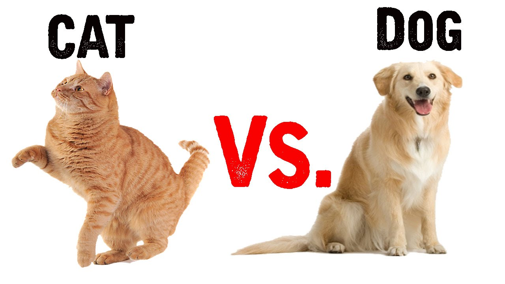
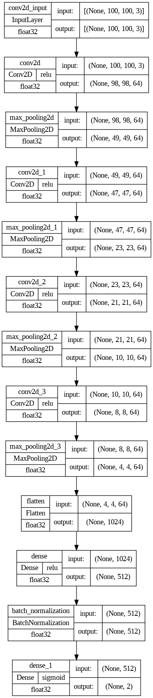
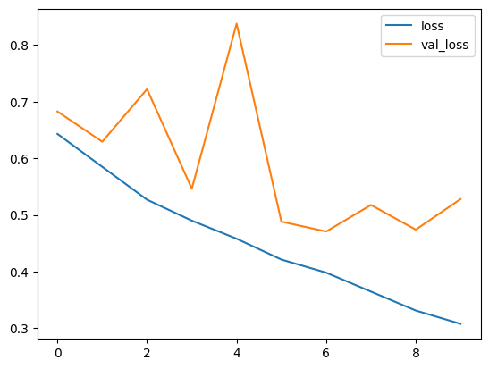
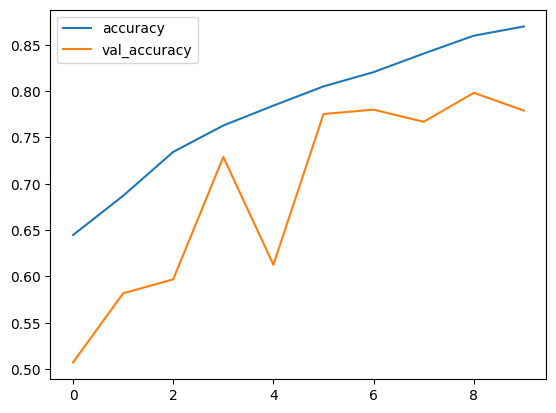
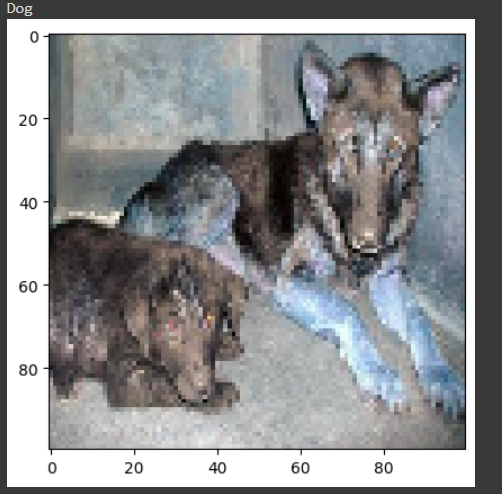
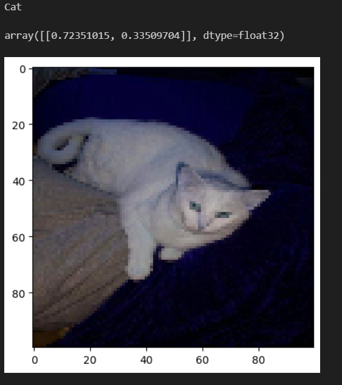

# Кошки и Собаки Распознавание

Этот репозиторий содержит обученную модель нейронной сети для распознавания изображений кошек и собак. Модель построена с использованием библиотеки Keras и представляет собой сверточную нейронную сеть с архитектурой, включающей четыре сверточных слоя с пулингом для извлечения признаков, плоский слой для выравнивания данных, полносвязный слой с 512 нейронами и функцией активации ReLU, а также слой нормализации данных и выходной слой с двумя нейронами и функцией активации sigmoid.

## Обзор архитектуры модели

Архитектура модели выглядит следующим образом:

1. Сверточный слой (64 фильтра, размер ядра 3x3)
2. Пулинг (размер пула 2x2)
3. Сверточный слой (64 фильтра, размер ядра 3x3)
4. Пулинг (размер пула 2x2)
5. Сверточный слой (64 фильтров, размер ядра 3x3)
6. Пулинг (размер пула 2x2)
7. Сверточный слой (64 фильтров, размер ядра 3x3)
8. Пулинг (размер пула 2x2)
9. Плоский слой для выравнивания данных
10. Полносвязный слой (512 нейронов) с функцией активации ReLU
11. Слой нормализации данных
12. Выходной слой с двумя нейронами и функцией активации sigmoid

## Обучение и Результаты

Модель обучалась на тренировочных данных, разделенных на тренировочную и валидационную выборки в соотношении 70% и 30% соответственно. Обучение проходило в течение 10 эпох. На 10-й эпохе достигнуты следующие показатели:

- Точность (accuracy) на тренировочных данных: 0.8697
- Точность (val_accuracy) на валидационных данных: 0.7789

## Тестирование

Для проверки работы модели на тестовых данных:

